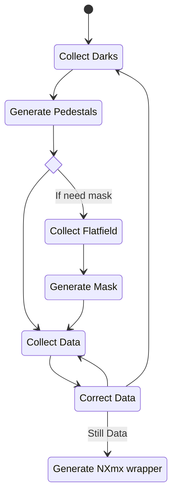

# Morgul - Software For Jungfrau Commissioning

Morgul is a software tool to assist with our commissioning efforts for the
Junfrau 1M detector.

Other non-morgul analysis tools and scripts can be found in https://github.com/DiamondLightSource/jungfrau-commissioning.

## Installation

Dependencies from `mamba` with:

```
mamba create -yp ENV napari pyside6 hdf5plugin h5py
mamba activate ENV/
```

Then:

```
git clone git@github.com:DiamondLightSource/python-morgul.git # or your fork
pip install -e python-morgul
```

N.B. the latter will install many things from `pip` which _probably_ could be installed in the `mamba` environment but this is assumed to be a self-contained install. `which morgul` should point to `bin/morgul` in the environment above.

## TL;DR
- Run at Diamond, or set `JUNGFRAU_GAIN_MAPS` to point to your download of the
  gain maps.
- Collect darks at all three gain modes, and give them to `morgul pedestal` to
  create a pedestal correction file. Do this often when collecting.
- Collect flat-field data and run `morgul mask` to calculate a pixel mask.
- Run `morgul correct`, giving the pedestal, mask, and data files. A
  `<data_file>_corrected.h5` output file will be written.
- You can view raw, calibrated and pedestal data with `morgul view`. If taking serial data, generate an NXmx nexus file with `morgul nxmx`.
- Set `JUNGFRAU_CALIBRATION_LOG` and pass `--register` to `morgul pedestal` and
  `morgul mask` if you want pedestal and mask data to be picked up
  automatically for corrections based on the time-nearest registered
  calibration data.

Example:
```
% morgul pedestal --register $DATA/2023-06-26-15-43-29_darks
...
...
Written output file jf1md_2ms_2023-06-26_15-43-29_pedestal in 1m 13s.
Copying jf1md_2ms_2023-06-26_15-43-29_pedestal to <log path>
Writing calibration log entry:
    PEDESTAL 2023-06-26T13:27:17.628631+00:00 0.002 <log_path>/jf1md_2ms_2023-06-26_15-43-29_pedestal

% morgul correct -e 12.4  $DATA/acnir_1_0.h5

Using detector: jf1md
Reading gain maps from: /dls_sw/apps/jungfrau/calibration
Correcting total of: 255960 images
Reading 2ms pedestals from: <log_path>/jf1md_2ms_2023-06-26_15-43-29_pedestal.h5
Reading 2ms mask from:      ........
```
## Prerequisites

To correct raw data, or generate masks from flatfield data, you must have the
gain calibration constants. If running on a Diamond workstation, this should be
picked up automatically (stored at `/dls_sw/apps/jungfrau/calibration` on the
shared filesystem). If you are running elsewhere, you will need a copy of this
data and to set the environment variable `JUNGFRAU_GAIN_MAPS` to point to the
location you have downloaded them. To test this is correctly done, run `morgul
gainmap`, which will read the gain map data and save it to a
`<detector>_calib.h5` file.

If you want pedestal and mask files to be found automatically by `morgul correct`, then you must set the `JUNGFRAU_CALIBRATION_LOG`
environment variable to point to a location where the pedestal runs
will be recorded. See the `morgul pedestal` description for details.

To view data or calibration files, you must have an environment with the python
package `napari` installed, and one of their supported GUI backends. If you
installed morgul into your own environment, you may need to do this manually.
Please see the [napari installation
guide](https://napari.org/stable/tutorials/fundamentals/installation.html) for
details on how to do this.

## Calibration Flow

The process of collecting and calibrating data is summarized by the following flowchart:



1. First, dark images must be collected in fixed gain modes `dynamic`,
   `forceswitchg1` and `forceswitchg2`, for exposure times matching that which
   you expect to take data. Currently, we expect that this will need to be done
   frequently throughout your data collection sessions - we have not characterised
   the long-term response yet.
2. Then the pedestal correction files are generated, with `morgul pedestal`.
3. If you do not have a mask file for the detector, then you should take some
   flat-field data and use `morgul mask` to analyse it for bad pixels, creating
   a mask file. This (probably[^1]) doesn't need to be done very often, or more
   than once.
4. Collect your data.
5. Correct the data with `morgul correct`. This will write out a
   `<filename>_corrected.h5` to the same folder as the input data.
6. Either collect more data, or re-collect darks to calibrate against any
   time-based drift of the dark current.

When ready to analyse the data, either a `.nxs` file will have been written
automatically on collection (for rotations), or you might need to generate a
simple NXmx file with `morgul nxs`.

[^1]:
    At this early stage, we haven't determined how often the mask needs to be
    regenerated. In commissioning so far, we have relied on one mask taken
    early in the process to apply for the whole week. A proper protocol for
    when this is required hasn't been worked out yet.

## Using Morgul

### Pedestal Calculation: `morgul pedestal`

```
Usage: morgul pedestal [-o OUTPUT_NAME] [--register] DATA_FILE ...
```
The first stage towards being able to correct diffraction images. Requires
three input files for gains 0 (fulfilled by being in dynamic mode while
dark),1, and 2 per module on the detector - on the 1M this means six files.
Each of the dark runs is checked for bad pixels, then the data averaged into
a pedestal image for each gain mode in each module. The dark runs must be taken
with exposure time equal to that which you intend to capture data.

#### Options

- `--register`: If this flag is set, and there is an environment variable
`JUNGFRAU_CALIBRATION_LOG`, pointing towards a log file, then upon completion
`morgul pedestal` will move the calculated pedestal file into the same
directory as the log, and add a line to the log file marking the timestamp,
exposure and location of the pedestal data. This log file can be used by
`morgul correct` to automatically work out what pedestal file to use for any
particular data collection, avoiding errors through manual bookkeeping.

- `-o OUTPUT`: By default, -pedestal will write to a file in the current working
directory with the name `<detector>_<exposure>ms_<timestamp>_pedestal.h5`. If
you want to specifically change the output name and location, you can set this
option.


### Mask Generation: `morgul mask`

```
Usage: morgul mask (--energy | -e) <keV> <PEDESTAL_FILE> FLAT_DATA ...
```

Given a set of flat-field data sets (one for each module), correct the data and
analyse it for excessively noisy pixels. The definition of "noisy" used at time
of writing is $\textrm{dispersion} > 3$ where $\textrm{dispersion} = \sigma^2 /
\overline x$. Because `morgul mask` corrects the data before looking at the
pixel statistics, it both requires knowledge of the photon energy used to
capture the data, passed with `--energy`, and a pedestal calibration file for
the same exposure times.

#### Options

`morgul mask` has the same extra options as -pedestal - `-o OUTPUT` for
changing the default name, and `--register` for writing to the calibration log.

### Correcting Raw Data: `morgul correct`

```
Usage: morgul correct [-p PEDESTAL] [-m MASK] -e ENERGY_KEV DATA_FILE ...
```

Convert raw data to photon counts, by subtracting pedestals, masking, and
applying the gain tables. Photon energy must be passed in explicitly (with
`--energy KEV | -e KEV`).

If no explicit pedestal (or mask) data is provided, and the environment
variable `JUNGFRAU_CALIBRATION_LOG` is set, then this file will be searched for
the nearest (in time) pedestal correction data that matches the exposure time
of the data files being corrected e.g. pedestal data created with
`morgul pedestal --register`

#### Options

- `-o OUTPUT`: By default, -correct will write out a corrected file in the same
  folder as the raw data, with a `_corrected.h5` suffix. With `-o`, you can
  select a different **folder** for these to be written to - this does not
  control the output filename, merely where they are placed.
- `--force`: By default, -correct will not overwrite existing files if they
  already exist in the target location. Specifying `--force` overrides this
  check.
- `--lookup-tolerance`: In automatic pedestal mode, by default the closest
  pedestal data (in time) is selected. If this is set, this specifies a maximum
  time (in minutes) when looking for the nearest pedestal data. This is useful
  to avoid accidentally e.g. using days-old pedestal data when starting a new
  day of collection, and forgetting to generate a new pedestal file.

### Nexus files for onward processing: `morgul nxmx`

```
Usage: morgul nxmx [-o output_name.h5] MODULE_CORRECTED_DATA ...
```

Generate a minimal
[NXmx](https://manual.nexusformat.org/classes/applications/NXmx.html)
still-image file, for onward processing and analysis. Currently NXmx files are
written by the acquisition system only for rotation collections. For
still/serial data sets this generates a minimalistic NXmx that can be used for
processing. It requires one data file per module, and you can override the
output filename with `-o OUTPUT_NAME.h5`.

## Viewing data: `morgul view`

```
Usage: morgul view FILENAME ...
```
A simple [napari](https://github.com/napari/napari)-based viewer for inspecting
input and output data from the morgul analysis steps. The kinds of data that it
can view are:
- Gain maps (as created by `morgul gainmap`)
- Mask files (as created by `morgul mask`)
- Pedestal files (from `morgul pedestal`) - all modules and gain modes are
  displayed at once.
- Raw data files - either a subset of modules on the detector, or all modules
  on the detector, and panels will be laid out in their approximate positions.
  More that one data collection of the same module is not supported.
- Corrected data files - with the same conditions as raw.

If not using the central install at Diamond, you will need to have napari and
one if it's supported backends installed. Please see the "Prerequisites"
section above for details on doing this.

## Errata

### Advanced: Runtime monitoring: `morgul watch`

```
Usage: morgul watch <PATH>
```

A developer tool for usage on collections: This tool will watch a target root
folder for new HDF5 files appearing, and display them once they become
readable. Probably not useful for general usage.

### Advanced: `morgul pedestal-fudge`

```
Usage: morgul pedestal-fudge INPUT_PEDESTAL EXPOSURE_TIME
```

Either extrapolates or divides down an existing set of pedestal corrections to
a new exposure time. Probably a bad idea, and we have at time of writing no
evidence that this results in valid pedestal files. Created because during the
first commissioning run we inadvertantly collected some data at nonstandard
exposure times, and didn't take corresponding dark images.

Documented here for completion' sake, but should not be relied on. Supports
`--register`, similarly to `morgul pedestal`, in case you want to make the
process of "correcting" raw data with unproven pedestal calibrations more
automatic.

### Expected Data Format

Data files are expected to be a separate HDF5 file for each module, each  with the following structure:
```
/data       Image data
/exptime    Exposure time this collection was taken in
/gainmode   What gain mode the module was set to
/timestamp  UTC timestamp of when the collection started. This is
            expected to match across multiple modules captured at
            the same time.
/column     The position of this module on the detector. Counting
            starts at 0 for the bottom-left module, and increases
            as you move to the right. This is used to identify a
            unique module for matching to gain and calibration data.
/row        Same as column, but row position.
```
